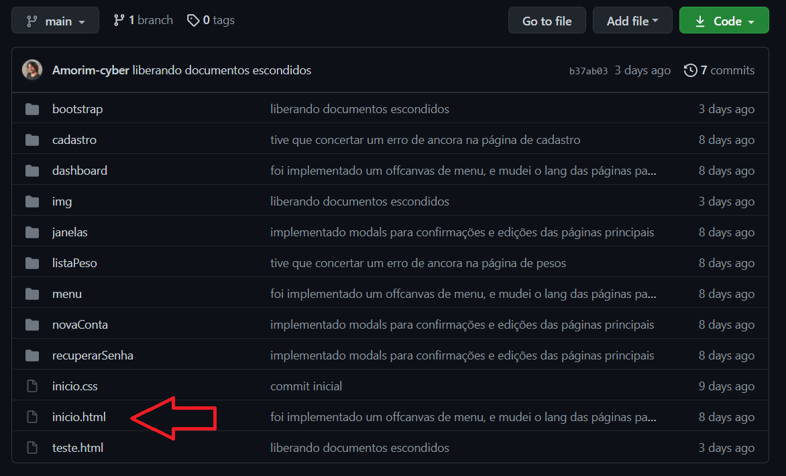
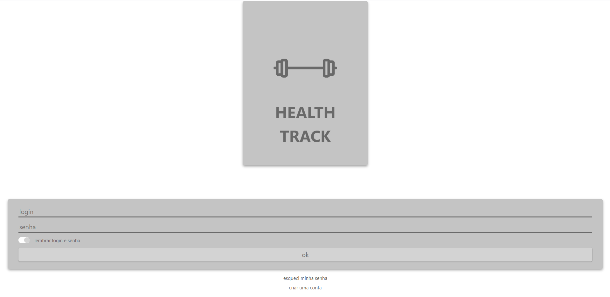
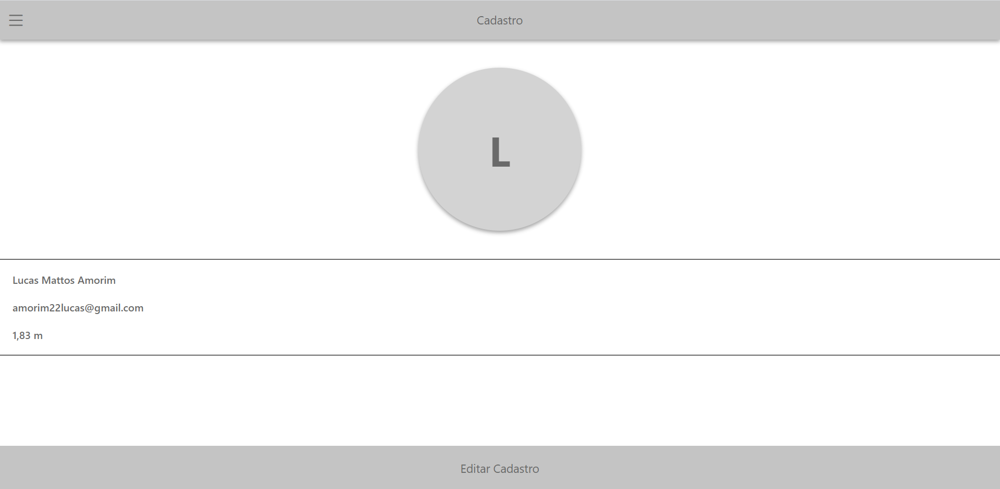
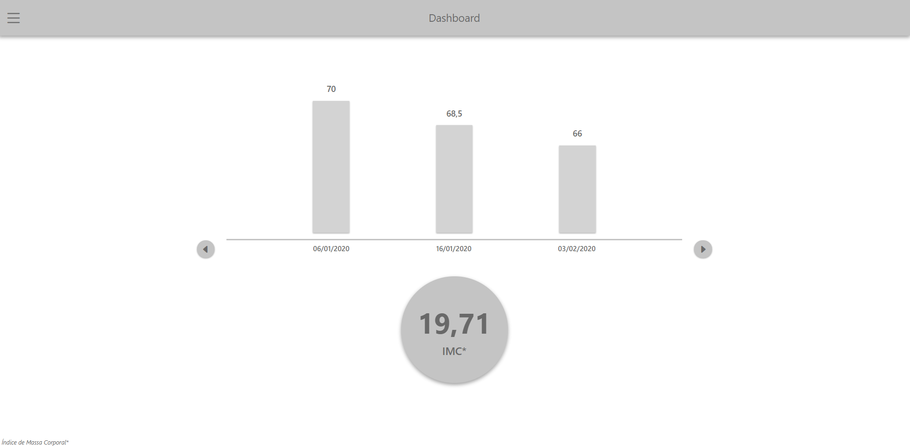
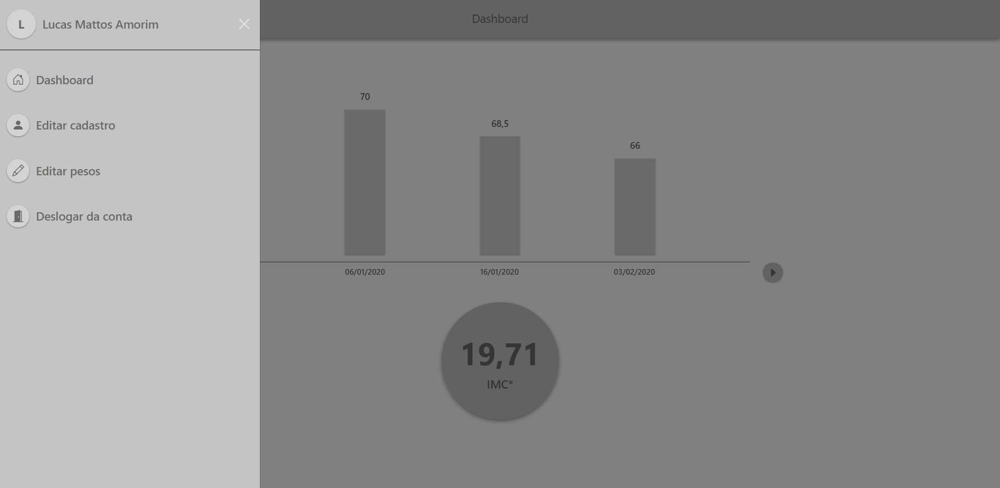

# :weight_lifting_woman: Health Track :weight_lifting_man:

### Bem vindos ao meu projeto do Health Track! :smile: 

> Tomei a liberdade de Separar esse readme nos seguintes tópicos:
>
> * Sobre o Health Track
> * Incialização
> * Componentes
> * Considerações finais

### Sobre o Health Track

> O Health Track é um aplicação inicialmente desenvolvida para o usuário registrar, editar e visualizar seu peso corporal ao longo do tempo.

>Os dados inputados serão expostos em gráficos de barra para uma melhor visualização. Também será feito um calculo do Índice de massa corporal (IMC) baseado no ultimo peso registrado junto com a altura do usuário.

> A aplicação utiliza as unidades de medida kilograma (kg) para medir o peso e centimetros (cm) para medir a altura.

> **Observação:** Estas features podem mudar conforme a evolução deste projeto

### Inicialização

> Para uma melhor experiência de navegação, recomendo que inicie a aplicação pelo arquivo inicio.html.

> </img>

> O arquivo inicio.html é a porta de entrada do projeto.

 

### Componentes

> O projeto está dividido nos seguintes componentes principais:
>
> * inicio
> * cadastro
> * dashboard
> * listaPeso
> * menu

#### inicio

</img>

> O inicio é composto pela página inicial, local onde o usuário coloca o seu login para entrar no programa.

> **Pontos a mencionar:** 
>
> 1. Neste primeiro esboço do projeto o usuário pode entrar independente do que ele coloca nos campos login e senha.
> 2. O toggle de lembrar senha por enquanto não tem efeito sobre o projeto.
> 3. Os demais recursos levam para outras páginas.

#### Cadastro

</img>

> O cadastro ilustra os dados principais do usuário, ele tem a opção de editar seus dados nessa mesma página.

> **Pontos a mencionar:** 
>
> 1. Ao clicar em editar, irá aparecer um pequeno formulário de alteração. Porém independente do que for posto neste formulário, os dados ainda vão permanecer os mesmos.

#### DashBoard

</img>

> O dashboard ilustra a evolução do peso do usuário ao longo do tempo e o IMC.

>**Pontos a mencionar:** 
>
>1. O usuário pode interagir com as setas laterais do gráfico, porém nada acontece ao clicar neles.

#### menu

</img>

> Menu serve como map de navegação do projeto, listando as opções do usuário.

### Considerações Finais

> O programa ainda está em desenvolvimento, contudo temos aparência e interação significativa para testes. Fique a vontade para dar uma olhada :smile: 
>
> Em breve novas atualizações, fiquem ligados!!